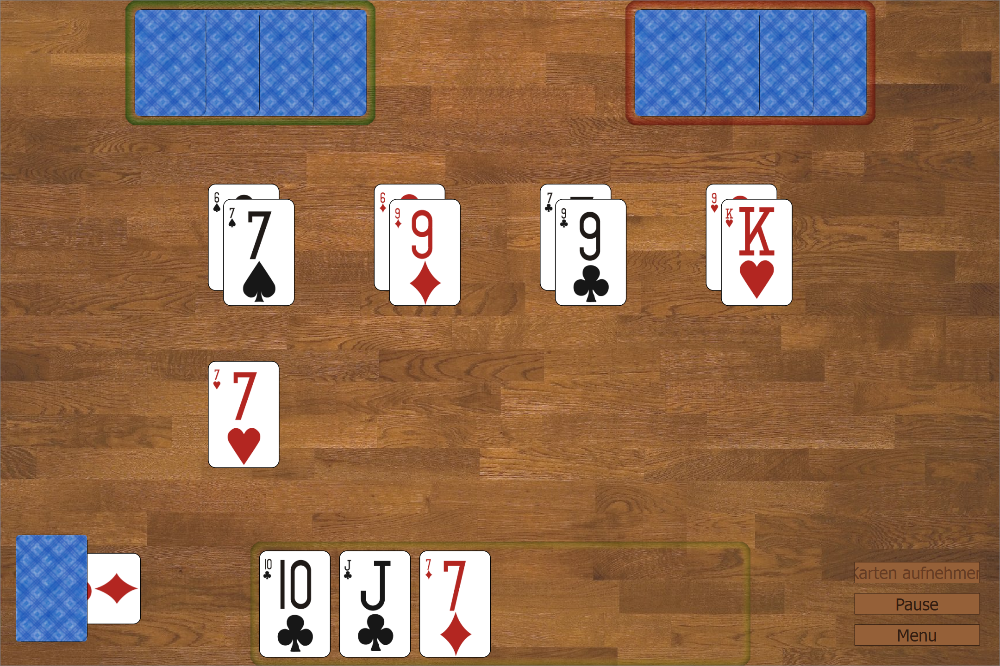

# Durak card game

## Rules

- Every player receives six cards
- Another card is layed open, representing the trump color (bottom left corner under the "stack" of remaining cards)
- A random player is selected as offender (marked green)

#### Start of round
- The offender starts a round by attacking the player to his left (the defender, marked red). 
- The player left to the defender (co-offender, marked yellow) may support the attack
- All other players (if there are any) do not participate in the current round
#### Attack and defence
- The offender attacks by laying cards open on the table according to the following rules:
  - A card of the same name/number is already on the table
  - The first card can be choosen freely
- The defender defends the attack by placing one of his cards on top of each of the cards layed by the offenders according to the following rules:
  - The cards have the same color (except for trump cards, which can always be played)
  - The card is of a higher score as the defended card (Order is 7, 8, 9, 10, J, Q, K, A, trump 7, trump 8, ... trump A)
- As long as the defender has enought cards, the offender and co-offender are allowed to play more and more cards (according to the rules given above) to reinforce their attack (simultaneously)
#### End of round
- If the defender has parried the attack by placing one of his own cards on each of the offenders cards, and neither offender or co-offender have layed out additional cards within 5 seconds, the round ends and all open cards are put away
- If the defender can not or does not want to parrie the attack anymore, he has to take all open cards on the table to his hand
- The offender for the next round is chosen depending weather the defender parried the attack or not:
  - If he or she parried, he has the privilege to be the next offender, attacking his former co-offender (the player to his left)
  - If he or she failed, the player to his left will become the next offender
- Before the next round starts, every player receives as much more cards from the stack until he or she has at least six cards
- If the stack is empty, the trump card is distributed last. Afterwards, no further cards are distributed
- Now the next round starts with the new offender

#### End of Game
- The first player that played all of his or her cards (if there are no cards left on the stack) is the winner of the game
- The remaining players continue until only one player is left. He or she is the loser ("Durak") of the game

#### Special rules
- An offender is allowed to start his attack with multiple cards of the same name/number
- If the defender has a card of the same name/number as the card(s), that was/were first layed open by the offender, he can place his card next to the offenders card(s). By doing so, he forwards the attack to the player left to him. Now, the former defender becomes the new offender and the former co-offender the new defender. However, this is only possible as long as the co-offender has not jet played a card to reinforce the attack.

## Control
#### Mouse / Touch
- Cards can be played easily via drag and drop
- A single click selects/unselects a card in order to play multiple cards at the same time
- A double click plays a card automatically
#### Keyboard
- Use `LEFT`/`RIGHT` arrows to select a single card or multiple cards by holding `SHIFT` in doing so
- Use the `UP` arrow to play the card automatically
- Use the `DOWN` arrow to unselect all cards. Press again, to take all cards
- `Ctrl`+`A` selects all cards
- `F11` toggles fullscreen mode
- `SPACE` pauses/resumes the game
- `M` opens the menu
- `Ctrl`+`N` starts a new game

## Requirements

- Python 2.7 (3 may work as well)
- PyQt4 
